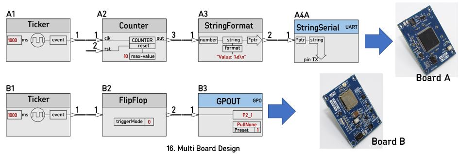
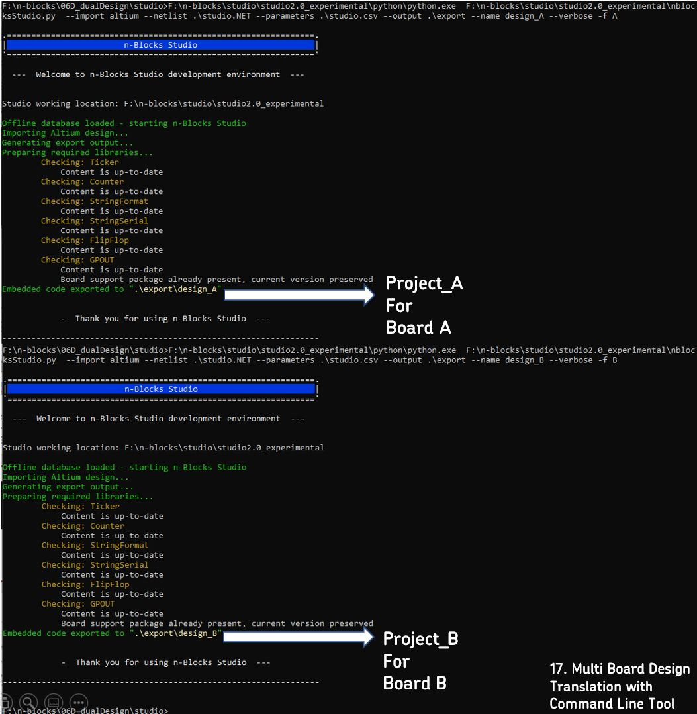

# 06D_dualDesign

Example nBlocksStudio project, testing the cli too Filter parameter, creating a multi board design as below

----

## Multi Board Design 

nBlocks Studio supports multi-board-design. That is the creation of the firmware of all different boards of a system in a single Design.  
This is achieved by using the filter capability of the command line tool, to create a separate C++ project for every different Prefix used in Nodes Designator. 

In above example using the filter we can create two C++ projects, so each flow (set of connected Nodes) runs in a different Microprocessor or Board.  

> To Export 2 projects for the fig.16 example above, we call the Command Line Tool twice. The first time with filter parameter `-f A` to include in the Exported **project 'A'** only the Nodes with Designator prefix 'A'. Then we call again the Command Line tool with filter parameter `-f B` to Export a **project 'B'** including only the Nodes with Designator prefix 'B'.

----

